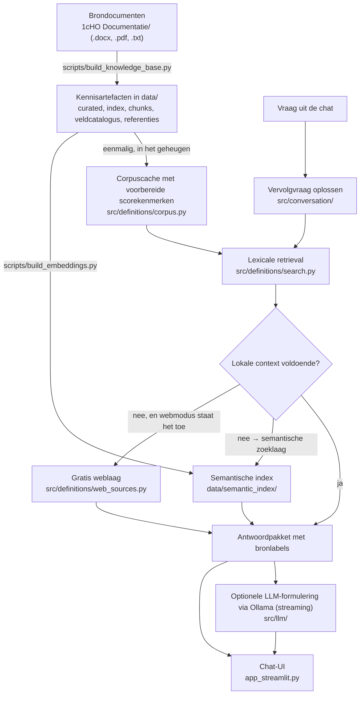

# VU EA Conversational AI

**Vraagbaak voor de 1cijferHO-documentatie van VU Education Analytics — antwoorden met bronvermelding uit de officiële documentatie.**

Een lokale, gratis-only chatassistent over de **1cijferHO-documentatie (1cHO 2025)**. Je stelt in gewoon Nederlands een vraag ("Wat is een internationale student?", "Waar verwijst `Opleiding historisch equivalent` naar?", "Toon alle velden van `Inschrijvingen_aggr_UNL_2025.csv`"), stelt vervolgvragen ("en op peildatum?") en krijgt antwoorden die aantoonbaar zijn terug te voeren op de officiële brondocumenten die in deze repository staan.

Het project is **evidence-first**: elk antwoord vermeldt uit welke bron het komt, wanneer aanvullende documentatie is gebruikt, wanneer een bron ontbreekt, en wanneer een tekst slechts een LLM-interpretatie is. Er wordt niets gegokt en er is geen betaalde API of API key nodig.

> **Let op:** de app beantwoordt vragen over de **documentatie** (definities, velden, codelijsten, verwijzingen). De feitelijke microdata zit er bewust nog niet in; zie [Toekomstig werk](#17-toekomstig-werk-en-volgende-stappen).

---

## Inhoud

1. [Snelstart: alleen `main.py` draaien](#1-snelstart-alleen-mainpy-draaien)
2. [Wat `main.py` precies doet](#2-wat-mainpy-precies-doet)
3. [Vereisten](#3-vereisten)
4. [Wat het project doet](#4-wat-het-project-doet)
5. [Hoe het werkt](#5-hoe-het-werkt)
6. [Projectstructuur](#6-projectstructuur)
7. [Alle commando's van `main.py`](#7-alle-commandos-van-mainpy)
8. [Ollama-modellen beheren](#8-ollama-modellen-beheren)
9. [Kennisbank opnieuw bouwen](#9-kennisbank-opnieuw-bouwen)
10. [Tests en evaluatie](#10-tests-en-evaluatie)
11. [Gratis-only ontwerp](#11-gratis-only-ontwerp)
12. [Webbronnen: allowlist, modi en discovery](#12-webbronnen-allowlist-modi-en-discovery)
13. [Bronstatus en interpretatie in de UI](#13-bronstatus-en-interpretatie-in-de-ui)
14. [Problemen oplossen](#14-problemen-oplossen)
15. [Hoe dit zich verhoudt tot ChatGPT en Claude](#15-hoe-dit-zich-verhoudt-tot-chatgpt-en-claude)
16. [Beperkingen](#16-beperkingen)
17. [Toekomstig werk en volgende stappen](#17-toekomstig-werk-en-volgende-stappen)

---

## 1. Snelstart: alleen `main.py` draaien

```bash
git clone <repo-url>
cd VU-EA-Conversational-AI

# Aanbevolen: eigen virtual environment
python -m venv .venv
source .venv/bin/activate          # Windows: .venv\Scripts\activate

# Dit ene commando doet de rest
python main.py
```

`python main.py` zonder verdere argumenten installeert de dependencies, haalt de benodigde Ollama-modellen op, bouwt eenmalig de semantische index en start de app. Je browser opent op <http://localhost:8501>; opent hij niet vanzelf, klik dan op de URL die in de terminal verschijnt. Stoppen doe je met `Ctrl+C`.

In PyCharm of VS Code is het equivalent: open `main.py` en klik op **Run** — er zijn geen extra run-configuraties, scripts of omgevingsvariabelen nodig.

**Welk commando start de app, en welk niet?** Dit is de meest gestelde vraag:

| Commando | Start de app in de browser? | Wat het wél doet |
|----------|-----------------------------|------------------|
| `python main.py` | ✅ ja | installeren, modellen, index, app starten — en meteen bereikbaar vanaf je telefoon |
| `python main.py --streamlit` | ✅ ja | hetzelfde, expliciet |
| `python main.py --local-only` | ✅ ja | hetzelfde, maar **niet** bereikbaar vanaf je telefoon |
| `python main.py --diagnose-network` | ❌ nee | uitzoeken waarom een ander apparaat er niet bij kan, en de firewallregel aanbieden |
| `python main.py --all` | ❌ nee | tests + build-dry-run + één voorbeeldvraag, alles in de terminal |
| `python main.py --tests` | ❌ nee | alleen de unittests |
| `python main.py --query "..."` | ❌ nee | één vraag beantwoorden in de terminal (met `--json` als JSON) |
| `python main.py --benchmark` | ❌ nee | retrieval-latency meten |
| `python main.py --setup` | ❌ nee | alleen installeren + modellen + index |

Elke terminal-only run eindigt met een samenvatting en de regel *"Start de VU EA Conversational AI-app met: python main.py"*, zodat je nooit hoeft te raden of er nog een browser hoort te openen.

Zie je bij `python main.py` de melding *"No run option selected; use --all for the standard full check"*? Dan draai je een oudere versie van dit bestand: haal de laatste versie op (`git pull`) en probeer opnieuw.

> **Eerste keer duurt langer.** De Python-pakketten zijn samen enkele honderden MB's, `qwen3:8b` is ongeveer 5 GB en `nomic-embed-text` ongeveer 0,3 GB; daarna bouwt de app eenmalig de semantische index (enkele minuten). Elke volgende start is snel: bestaande pakketten, modellen en index worden herkend en niet opnieuw gemaakt.

> **Windows.** Alles werkt hetzelfde; activeer de venv met `.venv\Scripts\activate`. Kan je console geen `✓` weergeven, dan schakelt `main.py` automatisch over op `[OK]`/`[FAIL]`.

> **Zonder Ollama werkt de app ook.** Als Ollama niet is geïnstalleerd, meldt `main.py` dat en start de app gewoon door. Je krijgt dan de volledige retrieval-antwoorden uit de lokale documentatie; alleen de optionele LLM-formuleerlaag is uitgeschakeld.

### Startpagina voor collega's (GitHub Pages)

Collega's die de repo niet kennen, kunnen starten via de projectpagina:

**<https://vusaverse.github.io/VU-EA-Conversational-AI/>**

Die pagina herkent hun besturingssysteem en geeft één knop: **⬇ Starter voor Windows / macOS /
Linux**. Dat bestand downloaden en dubbelklikken is de hele instructie. De starter regelt de rest:

| Stap | Wat de starter doet |
|------|---------------------|
| Python zoeken | Kijkt naar `python`, `python3`, de `py`-launcher **en** de standaard installatiemappen (`%LOCALAPPDATA%\Programs\Python\Python3*`, `C:\Program Files\Python3*`). Daardoor werkt het ook als PATH stuk is. De Microsoft Store-alias wordt herkend en overgeslagen. |
| Python installeren | Ontbreekt Python, dan installeert de starter hem: `winget` op Windows (met de officiële python.org-installer als terugval), Homebrew op macOS, `apt`/`dnf`/`pacman`/`zypper` op Linux. Daarna wordt PATH uit het register ververst, dus je hoeft geen nieuwe terminal te openen. |
| git installeren | Ontbreekt git, dan installeert de starter hem. Lukt dat niet, dan pakt Windows automatisch de ZIP-download. |
| Ollama installeren | Optioneel en nooit fataal: lukt het niet, dan draait de app door zonder LLM-laag. |
| Code ophalen | Clonet de repository, of werkt een bestaande kopie bij. |
| Starten | Maakt de virtual environment en draait `python main.py`, dat de dependencies installeert, de modellen ophaalt, de index bouwt en je browser opent. |

#### Ontwikkelstatus onderaan de pagina

Onder de voettekst staat een dichtgeklapt paneel **Ontwikkelstatus** — voor wie aan het project werkt, niet
voor wie de app wil starten. Openklappen laat drie dingen zien:

| Regel | Wat er staat |
|-------|--------------|
| Laatste merge | Nummer, titel, wie hem mergede en wanneer — met een link naar de pull request |
| main | De huidige commit op `main`, met de eerste regel van het commitbericht |
| Deze site | De commit die GitHub Pages heeft gepubliceerd, en of dat gelijk is aan `main` of hoeveel commits erachter |

**Het haalt pas iets op als je het openklapt.** De GitHub-API staat niet-ingelogde verzoeken 60 keer per uur
per IP toe, en op een universiteitsnetwerk deelt een heel gebouw dat ene adres. Een gewone bezoeker hoort dat
budget niet op te maken voor een paneel dat hij nooit opent. Binnen dezelfde sessie komt een tweede blik uit
`sessionStorage`, dus herladen kost niets extra.

Loopt het mis, dan zegt het paneel wat er mis is in plaats van leeg te blijven: bij een bereikte API-limiet
staat dat er met de reden, en geeft GitHub geen deployment vrij voor deze pagina, dan zegt het dat de live
commit van buitenaf niet vast te stellen is — liever dat dan een bewering die niet klopt.

Wie liever plakt dan klikt, vindt op dezelfde pagina één commando:

```powershell
irm https://vusaverse.github.io/VU-EA-Conversational-AI/start-windows.ps1 -OutFile start.ps1
powershell -ExecutionPolicy Bypass -File .\start.ps1
```
```bash
curl -fsSL https://vusaverse.github.io/VU-EA-Conversational-AI/start.sh | bash    # macOS/Linux
```

**Niets laten installeren?** Zet `VUEA_NO_INSTALL=1`; de starter meldt dan alleen wat er ontbreekt.
De starters luisteren daarnaast naar `VUEA_REPO_URL`, `VUEA_DIR` en `VUEA_BRANCH`.

#### Als de starter geblokkeerd wordt

Op sommige beheerde laptops mag geen enkel gedownload script draaien ("This script contains malicious
content…", of Windows Security die het bestand zonder meer weigert). Dat is beleid, geen fout in het
bestand. De pagina houdt daarvoor een handmatige route achter de hand:

```powershell
python --version          # eerst controleren; zie de tabel hieronder als dit faalt
git clone https://github.com/vusaverse/VU-EA-Conversational-AI.git
cd VU-EA-Conversational-AI
python -m venv .venv
.\.venv\Scripts\python.exe main.py
```

Faalt `python --version` met *"Program 'python.exe' failed to run: The system cannot find the path
specified"*, dan zit je tegen de Microsoft Store-alias aan. Wat je dan moet doen verschilt per laptop,
dus kijk eerst met `where.exe python` (en `py -0p`) wat Windows precies pakt:

| Wat `where.exe python` toont | Wat er aan de hand is | Wat je doet |
|------------------------------|-----------------------|-------------|
| **Alleen** een pad met `\WindowsApps\`, of niets (`INFO: Could not find files`) | Er staat geen Python op deze laptop; `\WindowsApps\python.exe` is een lege doorverwijzing naar de Microsoft Store | Installeer Python: `winget install -e --id Python.Python.3.12`, of via [python.org](https://www.python.org/downloads/windows/) met *"Add python.exe to PATH"* aangevinkt. Open daarna een **nieuwe** PowerShell. |
| Een `\WindowsApps\`-pad **én** een echt pad (`...\Programs\Python\Python312\python.exe`) | Python staat er wel, maar de Store-alias staat er in PATH vóór | Zet de alias uit via **Instellingen → Apps → Geavanceerde app-instellingen → App-uitvoeringsaliassen** (`python.exe` en `python3.exe`), of gebruik het echte pad rechtstreeks: `& "$env:LOCALAPPDATA\Programs\Python\Python312\python.exe" -m venv .venv` |
| Alleen een echt pad, maar `python --version` faalt nog steeds | Dit venster draait met de PATH van vóór de installatie | Sluit alle PowerShell-vensters en open er één nieuw. |

`$env:LOCALAPPDATA` vult de gebruikersmap automatisch in, dus dat deel klopt bij iedereen; de
versiemap (`Python312`, `Python313`, of een pad onder `C:\Program Files\`) moet je overnemen uit wat
`py -0p` bij jou toont. Dit is precies de diagnose die de starter zelf doet — je hebt hem alleen nodig
als de starter niet mág draaien.

**Waarom niet één knop die alles doet?** Geen enkele browser laat een website programma's op je
computer draaien — dat is de belangrijkste beveiligingsgrens die een browser heeft, en die staat er
terecht. Eén klik levert daarom de starter af; die doet vanaf dat punt alles automatisch. Verder
komt geen enkele website, hoe hij er ook uitziet.

**Pages aanzetten** (eenmalig, vereist een publieke repository): GitHub → **Settings** → **Pages** → Source: *Deploy from a branch* → Branch: `main`, map `/docs` → **Save**. Na ongeveer een minuut staat de pagina online. De bestanden staan in `docs/`; wijzig je ze, dan publiceert GitHub de nieuwe versie vanzelf bij de volgende push.

**Fork of eigen kopie?** De startscripts luisteren naar `VUEA_REPO_URL`, `VUEA_DIR`, `VUEA_BRANCH` en `VUEA_NO_INSTALL`, dus je kunt ze zonder aanpassing op een andere repository, map of branch richten — of ze laten melden wat er ontbreekt zonder iets te installeren.

### Kan het op een telefoon?

**Vragen stellen kan wel, meteen, zonder installatie — en zonder netwerk.** De zoeklaag is een opzoekactie
over een paar honderd definities, klein genoeg om in de browser te draaien. Daar staat een antwoordlaag
bovenop die de vraag leest en er een antwoord met bron van maakt. Samen staan ze als losse pagina op
GitHub Pages:

**<https://vusaverse.github.io/VU-EA-Conversational-AI/zoek.html>**

Zet hem op je beginscherm (op een iPhone: **Deel → Zet op beginscherm**) en hij werkt daarna **offline**. Een
service worker bewaart de pagina en de definities op het toestel; er is daarna geen verbinding meer nodig,
ook niet met deze repository.

Dat is meteen het antwoord op kantoornetwerken die verkeer tussen apparaten blokkeren. Op eduroam krijgt een
laptop een publiek adres (`130.37.x.x`) en staat clientisolatie aan: je telefoon kan de laptop niet bereiken,
hoe goed de firewall ook staat. Deze route heeft de laptop niet nodig, dus er valt niets te blokkeren.

Bovenaan staat **← Startpagina**, terug naar de installatiepagina. Die link is relatief (`href="./"`), dus
hij volgt vanzelf de plek waar de pagina staat — onder welke GitHub-eigenaar dan ook, op een eigen server of
vanaf `file://`. De startpagina zit ook in de offline-cache: een terugknop die alleen mét netwerk werkt is
precies verkeerd om voor een app die juist voor de situatie zónder netwerk bestaat.

Verwante velden zijn aantikbaar: een verwijzing in de documentatie brengt je naar dat veld, wat op een
telefoon een stuk prettiger is dan een naam overtypen.

#### De antwoordlaag op de telefoon

De pagina laat niet alleen treffers zien, ze beantwoordt de vraag. Ze herkent waar de vraag om gaat en
welk soort antwoord erbij hoort:

| Vraag | Wat de pagina doet |
| --- | --- |
| *Wat is een internationale student?* | De definitie, met de bestanden waarin het begrip voorkomt |
| *Welke waarden heeft Opleidingsvorm?* | De codelijst: `1 = voltijd`, `2 = deeltijd`, `3 = duaal onderwijs` |
| *Wat betekent code 6 bij CROHO-onderdeel?* | `6` betekent *economie* — en bij een code die er niet staat, dát er niets over staat |
| *In welk bestand vind ik Opleidingsvorm?* | De bestanden, met het veldnummer erbij |
| *Verschil tussen X en Y?* | Beide definities naast elkaar, met de mededeling dat de bron ze zelf niet vergelijkt |
| *En de waarden daarvan?* | Hetzelfde onderwerp als de vorige vraag; het onderwerp blijft staan |

**Dit is geen taalmodel, en het doet ook niet alsof.** Elk feit in een antwoord staat letterlijk in de
documentatie; de pagina kiest en ordent, ze formuleert niet. Dat is precies waarom ze op een telefoon kan
draaien: er is geen model te laden, geen server te bereiken, geen wachttijd. Een test controleert de claim
door voor vijftien vragen elk feit uit elk antwoord terug te zoeken in de gepubliceerde data.

Waar de bron onbruikbaar is, zegt de pagina dat. Onzin levert geen antwoord op, en een vervolgvraag erft
geen oud onderwerp.

#### De begrippen zijn geknipt waar de bron zelf zegt dat ze ophouden

Alle 42 begrippen in `data/ho_definities_curated.json` staan op `generated_by: automatic_ingestion`. De 23
met `confidence 0.99` zijn met de hand ingevoerd, kort en schoon. De 19 daaronder komen rechtstreeks uit de
brondocumenten en hebben vier mechanische mankementen. `src/definitions/curated_cleanup.py` herstelt ze —
en knipt alleen, het herschrijft nooit. Een test controleert dat: elk overgebleven stuk tekst moet letterlijk
in de brontekst terug te vinden zijn.

| Wat er misging | Waaraan de bron het zelf verraadt |
|----------------|-----------------------------------|
| De volgende paragraaf liep mee | Een kopje heeft een rij streepjes eronder; daar wordt geknipt |
| De codelijst stond als proza in de tekst | `Mogelijke waarden:` — daarna is het een lijst, dus wordt het er een |
| De laatste code slokte de volgende sectie op | Die staart begint met de náám van een ander begrip, met hoofdletter, gevolgd door een nieuwe zin |
| Er stond eerst een blok afleidingsregels | De tekst begint met `o Als …` of een vergelijking; de definitie is wat na de laatste regel komt |

Het effect, gemeten: **30.480 → 15.224 tekens proza**, en zeven muren van 2000+ tekens werden een definitie
van ± 100 tekens plus een codelijst van veertien regels. `Sleutel domein actuele opleiding` ging van 2407
tekens naar 295 tekens tekst plus 14 waarden.

Wat daarna nog een tabel of een kopje is, blijft vindbaar maar wordt gemarkeerd (`"answerable": false`).
De antwoordlaag weigert er een definitie van te maken, en in de resultatenlijst staat zo'n item dichtgeklapt
met de reden erbij in plaats van als muur tekst. Een uitgeschreven layouttabel herkent
`looks_like_layout_dump()` — dezelfde functie die de app daarvoor al gebruikte.

**En de bronvermelding zegt nu iets.** Elke definitie toonde `Bron: 1cHO-documentatie`, want geen enkel
begrip heeft een `note` en dat was de terugvalwaarde. Ondertussen stond het echte document in
`source_documents`, ongebruikt. Twintig van de 42 noemen nu hun eigen bestand; de rest houdt het generieke
label, want daar ís geen document bekend.

Wat hier niet zit is de taalmodel-laag: vrij formuleren, doorvragen over meerdere beurten, nuances
combineren. Die draait lokaal en heeft een computer nodig. Bouwen doe je met `python scripts/build_pages_data.py`,
dat schrijft `docs/data/definities.json` (± 80 kB) uit dezelfde kennisbank die de app gebruikt. Er gaat
geen studentdata en geen synthetische data in die export — alleen documentatie die al publiek in deze
repository staat.

**De hele app op een telefoon draaien: nee.** Het is een Python-server met een lokaal taalmodel ernaast.
iOS staat niet toe dat een app zomaar programma's uitvoert, en een `.bat` is bovendien Windows-only —
download je die op een iPhone, dan gebeurt er dus niets. Op Android kan het technisch via Termux (Python
en Streamlit draaien daar), maar de Ollama-modellen van enkele gigabytes maken dat in de praktijk
onwerkbaar.

**Gebruiken vanaf een telefoon: ja, en dat werkt vanzelf.** `python main.py` luistert standaard ook op je
lokale netwerk. In de zijbalk staat onder **📱 Op je telefoon openen** het adres én een QR-code; scannen en
je bent er. Laptop en telefoon moeten wel op hetzelfde wifi-netwerk zitten.

Waarom geen knop om dit aan te zetten? Streamlit legt zijn luisteradres vast bij het starten, dus een knop
in de app kan het achteraf niet meer wijzigen. De enige andere route was Ctrl+C en opnieuw starten — precies
de stap die in de weg zat, want Ctrl+C sluit alles af. Meteen op het netwerk luisteren haalt die stap weg.

Wil je dat niet, dan houdt `python main.py --local-only` de app op deze computer; het koppelpaneel zegt dan
dat hij niet bereikbaar is, in plaats van een adres te tonen dat het niet doet.

Wat waar draait: de app, de documentatie, het taalmodel en je vragen blijven volledig op je laptop. De
telefoon toont alleen het scherm.

> **Let op:** met de standaard kan iedereen op hetzelfde netwerk de app openen. Op je eigen wifi of een
> VU-netwerk is dat doorgaans prima; op openbare wifi niet — gebruik daar `--local-only`. Windows vraagt de
> eerste keer of Python door de firewall mag; sta dat toe voor particuliere netwerken, anders kan je telefoon
> er niet bij.

#### Zwart scherm op de telefoon, en daarna een time-out

Let eerst op wat je browser precies zegt, want dat scheidt twee heel verschillende problemen:

* *"kon de pagina niet openen"* / *"server reageert niet"* — de verbinding komt **helemaal niet** tot stand.
  Er zit iets tussen: een firewall, beveiligingssoftware, of het netwerk. Dat is het geval dat hieronder
  behandeld wordt.
* **De pagina laadt wel en blijft daarna leeg** — dan is de HTML binnengekomen en komt alleen de
  websocket-verbinding niet tot stand. Dat is zeldzaam en wijst op iets tussen browser en app (een proxy).

Bij het eerste geval gaat het dus om bereikbaarheid, niet om Streamlit.

**Laat de app het uitzoeken.** In de zijbalk, onder **📱 Op je telefoon openen**, zit de knop
**🔎 Waarom kan mijn telefoon er niet bij?**. Vanuit de terminal kan het ook:

```bash
python main.py --diagnose-network
```

Die controleert wat controleerbaar is en trekt een conclusie:

| Controle | Wat het uitsluit |
|----------|------------------|
| Luistert de app op je netwerkadres? | Onderscheidt "staat dicht" van "staat open maar wordt geblokkeerd" — verkeer naar je eigen adres passeert de firewall niet, dus dit meet echt het luisteren. |
| Wat voor adres heeft deze laptop? | `192.168.x.x` of `10.x.x.x` is een adres binnen je eigen wifi, dat je telefoon kan bereiken. Krijgt de laptop een **publiek** adres (op de VU `130.37.x.x`), dan zit je op een netwerk dat zijn apparaten uit elkaar houdt — en dat is de enige oorzaak waar élke controle op de laptop groen staat en je telefoon tóch niets krijgt. |
| Welk netwerkprofiel geeft Windows dit netwerk? | Een firewallregel voor *Privé* doet niets op een netwerk dat Windows *Openbaar* noemt. Dit is een klassieke reden dat "de fix niet werkt". |
| Staat de firewall aan, en is er een inkomende regel voor deze app? | Dit is de enige oorzaak die de app zelf kan verhelpen. |

Vindt hij een ontbrekende firewallregel, dan biedt hij aan die toe te voegen. Windows vraagt daarbij eenmalig
om beheerdersrechten. De regel is zo smal mogelijk: alleen deze Python, alleen TCP, alleen poort 8501, alleen
het netwerkprofiel waar je nu op zit. Terugdraaien:

```powershell
Remove-NetFirewallRule -DisplayName "VU EA Conversational AI"
```

**Als het toevoegen mislukt.** Het verhoogde PowerShell-venster sluit zichzelf zodra het klaar is, dus de
foutmelding van Windows zou voorbijflitsen. Die wordt opgevangen en in de app getoond, want juist díe tekst
zegt wat er aan de hand is:

* *"toegang geweigerd"* of iets over **group policy** — het beleid van je organisatie verbiedt het aanmaken
  van firewallregels. Dat is niet vanuit de app op te lossen.
* **geen venster verschenen** — de UAC-vraag is geweigerd, of je hebt geen beheerdersrechten op deze laptop.

In beide gevallen toont de app twee uitwegen: het commando om zelf in een PowerShell-als-beheerder te
draaien, en een kant-en-klare tekst voor je IT-beheerder met poort, pad en de exacte regel erin.

#### De hotspot-route: de enige waar niets tussen kan zitten

Deelt je telefoon zijn verbinding, dan is de telefoon zelf de router. Er is dan geen bedrijfsnetwerk, geen
beleid en geen clientisolatie tussen de twee apparaten. Dat maakt het de route die het altijd doet.

1. Zet op je telefoon de **persoonlijke hotspot** aan.
2. Verbind **deze laptop** met die hotspot.
3. Klik in het paneel op **🔄 Nieuw adres ophalen** en scan de nieuwe QR-code.

**Herstarten hoeft niet.** De app luistert op `0.0.0.0`, en zo'n socket hoort niet bij de netwerkkaarten
die er tijdens het starten waren: hij accepteert ook op een adres dat pas later verschijnt. Nagemeten door
een socket op `0.0.0.0` te binden, dáárna een nieuw adres op de machine te zetten en er verbinding mee te
maken — dat lukt. Ctrl+C is dus niet nodig, en dat was precies de stap die deze route onbereikbaar liet
voelen.

Het paneel herkent de bekende hotspot-bereiken (`172.20.10.x` voor iPhone, `192.168.43.x` voor Android,
`192.168.137.x` voor de mobiele hotspot van Windows) en bevestigt dat je erop zit. De diagnose weet het
ook: op een hotspot noemt hij clientisolatie niet meer als verklaring, want die kán het daar niet zijn.

Eén ding blijft over: Windows kan de hotspot als een **nieuw netwerkprofiel** zien, en een firewallregel
geldt per profiel. Blijft het scherm zwart, druk dan nog eens op **🔎 Waarom kan mijn telefoon er niet
bij?** — die ziet het profielverschil en biedt de juiste regel aan.

**Als het adres het netwerk verraadt.** Staat alles op de laptop goed en heeft de laptop een publiek
adres, dan noemt de diagnose dat als de conclusie in plaats van een vage "het zal het netwerk wel zijn". Er
is dan geen firewallregel die helpt: de blokkade zit in het netwerk, voordat het verkeer hier is. Het
koppelpaneel waarschuwt daar ook zelf, naast de QR-code — die blijft staan, want op een netwerk zónder
clientisolatie werkt hij gewoon.

**Een blokkeerregel wint van een toestaan-regel.** Wie ooit op *Annuleren* klikte bij de firewallvraag van
Windows, heeft daarmee blokkeerregels voor Python laten aanmaken. Zolang die er staan, verandert het
toevoegen van een toestaan-regel niets — Windows geeft blokkeren altijd voorrang. De diagnose telt die regels
en zet het verwijdercommando erbij, vóór hij een nieuwe regel voorstelt.

**Een regel die bestaat is niet hetzelfde als een regel die geldt.** Een firewallregel hoort bij een
netwerkprofiel: *Privé*, *Openbaar* of *Domein*. Staat de regel op Privé terwijl Windows je wifi als Openbaar
ziet, dan doet hij niets — en dat is precies hoe het eruitziet alsof de fix niet werkte. De diagnose
controleert daarom of de regel ingeschakeld is, inkomend is, toestaat, én voor het huidige profiel geldt.
Klopt dat laatste niet, dan biedt hij aan de regel te vervangen door één voor het juiste profiel.

**Als Windows Firewall in orde is en er tóch niets doorkomt.** Dan kijkt de diagnose verder, want op een
beheerde laptop is Windows Firewall zelden de enige poortwachter:

* **Andere beveiligingssoftware.** Pakketten als endpoint-protection hebben een eigen firewall die inkomend
  verkeer los van Windows blokkeert. De diagnose leest uit welke firewallproducten bij Windows geregistreerd
  staan en noemt ze bij naam. De app kan daar niets aan veranderen; dat is een verzoek aan je IT-beheerder.
* **Brede blokkeerregels.** Een beleidsregel die alle inkomend verkeer op dit profiel dichtzet, hangt niet aan
  een programma en wint toch van onze toestaan-regel. Die worden geteld en bij naam genoemd.

Deze tweede ronde draait alleen als Windows Firewall zelf niets verklaart — anders is de oorzaak al gevonden
en kost het alleen tijd.

**Een andere poort proberen.** Beveiligingssoftware werkt vaak met poortlijsten: 8080 mag wel, 8501 niet.
Dat is in één commando te testen:

```bash
python main.py --port 8080
```

Werkt het daarmee wel, dan zat de blokkade op de poort en niet op de app.

**Hoort de firewallregel wel bij dit programma?** Een regel geldt voor één executable, en dat is niet
vanzelfsprekend degene waarmee jij de app start: een virtual environment op Windows kan draaien onder de
image van de basisinterpreter, en de firewall kijkt naar die image. Staat de regel op
`.venv\Scripts\python.exe` terwijl de poort wordt opengehouden door
`AppData\Local\Programs\Python\Python312\python.exe`, dan is de regel geldig, correct en volstrekt
irrelevant — en de firewall lijkt in orde.

De diagnose leest daarom welk proces de poort werkelijk openhoudt, vergelijkt dat pad met de regel, en maakt
de regel bij een verschil opnieuw aan **voor het luisterende programma**.

**De route die niemand kan dichtzetten.** Blijft het hangen op het netwerk of op software buiten de app, dan
toont het paneel de hotspot-route: zet de hotspot van je telefoon aan, verbind je laptop daarmee, herstart de
app en scan de nieuwe QR-code. De telefoon is dan zelf het netwerk, dus er zit geen router of beleid tussen.

**Als het beleid inkomende regels negeert.** Organisaties zetten op het profiel *Openbaar* vaak
`AllowInboundRules` uit. Dan negeert Windows álle inkomende toestaan-regels, hoe correct ze ook zijn. De
diagnose leest dat uit en zegt het: de firewallroute is dan dicht en blijft dicht. Wat overblijft is de
hotspot van je telefoon, of de
[vraagpagina](https://vusaverse.github.io/VU-EA-Conversational-AI/zoek.html), die je vraag op het toestel
zelf beantwoordt en daarvoor helemaal geen verbinding met je laptop nodig heeft.

**Eén ding kan geen enkele test vanaf deze machine vaststellen:** of het wifi-netwerk verkeer tussen apparaten
toestaat. Faalt de diagnose op niets, dan is dat wat overblijft — zie de tabel hieronder.

**Handmatig, als je liever zelf kijkt.** Open het netwerkadres (dus `http://192.168.x.x:8501`, niet
`localhost`) in de browser van je laptop. Werkt dat niet, dan luistert de app niet op dat adres — probeer een
van de andere adressen die het paneel toont.

Werkt het op de laptop wel en op de telefoon niet, dan zit het tussen de twee apparaten:

| Oorzaak | Hoe je het herkent | Wat je doet |
|---------|--------------------|-------------|
| **Clientisolatie op het wifi-netwerk** | Geen enkel adres werkt; veel gast- en universiteitsnetwerken (ook eduroam) verbieden verkeer tussen apparaten. Herkenbaar aan een publiek adres (`130.37.x.x`) in plaats van `192.168.x.x` — het paneel zegt het er zelf bij | Zet je laptop op de hotspot van je telefoon en klik op **🔄 Nieuw adres ophalen**; herstarten hoeft niet. Werkt het dan wel, dan was dit de oorzaak. |
| **Firewall** | Windows vroeg bij de eerste start of Python door de firewall mocht, en dat is gemist of geweigerd. Geblokkeerd verkeer wordt weggegooid, niet geweigerd — vandaar het lange wachten | **Windows-beveiliging → Firewall- en netwerkbeveiliging → Een app door de firewall toestaan** → zoek Python, vink *Privé* aan |
| **Verkeerd adres** | Je hebt een VPN, Docker of een tweede netwerkadapter, dus het eerste adres is niet je wifi | Probeer de andere adressen; het paneel toont ze met een eigen QR-code |

Controleer ook of je telefoon écht op wifi zit en niet op 4G/5G — dat is de stilste oorzaak van dit symptoom.

Het koppelpaneel in de app bevat dezelfde uitleg onder **Zwart scherm of "server reageert niet"?**, met jouw
eigen adressen erin ingevuld.

---

## 2. Wat `main.py` precies doet

`python main.py` voert vijf stappen uit, in deze volgorde:

| # | Stap | Commando dat intern draait | Gedrag bij problemen |
|---|------|----------------------------|----------------------|
| 1 | **Dependencies installeren** | `python -m pip install -r requirements.txt` | Faalt pip terwijl alle pakketten al aanwezig zijn, dan gaat de run door. Ontbreken er pakketten, dan stopt de run met een venv-instructie. |
| 2 | **Ollama-modellen klaarzetten** | check `ollama` op PATH → zo nodig `ollama serve` in de achtergrond → `ollama pull qwen3:8b` en `ollama pull nomic-embed-text` als ze nog niet lokaal staan | Nooit fataal. Ontbrekende installatie, onbereikbare server of mislukte download worden als waarschuwing getoond; de app start alsnog. |
| 3 | **Semantische index bouwen** | `scripts/build_embeddings.py` (eenmalig, alleen als de index ontbreekt) | Geen Ollama of geen embeddingmodel? Dan wordt de stap overgeslagen met uitleg; de app werkt door op de lexicale zoeklaag. |
| 4 | **Synthetische voorbeelddata** | `scripts/generate_mock_data.py` (eenmalig, alleen als hij ontbreekt) | Nooit fataal en ± 1 seconde werk. Zonder deze stap toont de app geen voorbeeldwaarden; verder verandert er niets. |
| 5 | **App starten** | `python -m streamlit run app_streamlit.py` | Ontbreekt Streamlit (bijvoorbeeld na `--skip-install`), dan volgt een duidelijke instructie in plaats van een stacktrace. |

Details van stap 2 (`src/llm/ollama_setup.py`):

* **Installatiecheck** — staat `ollama` op PATH? Zo niet, dan volgt een platform-specifieke installatietip (`https://ollama.com/download`, `brew install ollama` of `curl -fsSL https://ollama.com/install.sh | sh`).
* **Serverstart** — reageert `http://127.0.0.1:11434/api/tags` niet, dan wordt `ollama serve` losgekoppeld in de achtergrond gestart en wordt maximaal 30 seconden gewacht tot de API antwoordt. De server blijft draaien nadat je de app afsluit.
* **Modelcheck** — `/api/tags` geeft de lokaal aanwezige modellen. Een model zonder tag (`qwen3`) matcht met `qwen3:latest`, net zoals Ollama zelf doet.
* **Download** — ontbreekt een model, dan draait `ollama pull <model>` met zichtbare voortgang in je terminal.

Stappen overslaan of aanpassen:

```bash
python main.py --skip-install                 # niets installeren, alleen modellen + index + app
python main.py --skip-models                  # geen Ollama-check/download, alleen app
python main.py --skip-embeddings              # geen semantische index bouwen
python main.py --setup                        # alleen stap 1 t/m 3, app niet starten
python main.py --model qwen3:4b               # ander chatmodel downloaden en gebruiken
python main.py --embed-model embeddinggemma   # ander embeddingmodel
python main.py --ollama-url http://host:11434 # Ollama draait ergens anders
```

Checks (`--tests`, `--dry-build`, `--check-hygiene`, `--benchmark`, een `--query` zonder `--llm`) downloaden **nooit** een model en bouwen **nooit** een index: die stappen worden alleen uitgevoerd als je de app start, `--setup`/`--build-embeddings` gebruikt, of expliciet `--llm` vraagt.

---

## 3. Vereisten

| Onderdeel | Versie / opmerking |
|-----------|--------------------|
| Python | 3.10 of nieuwer (de code gebruikt `X \| None`-typehints) |
| pip | recent genoeg voor wheels; wordt door `main.py` aangeroepen |
| Schijfruimte | ± 1 GB voor Python-pakketten, ± 5 GB voor `qwen3:8b`, ± 0,3 GB voor `nomic-embed-text` |
| Ollama | **optioneel**, voor de LLM-laag én de semantische zoeklaag — <https://ollama.com/download> |
| Internet | alleen nodig voor de eerste installatie, model-download en de optionele weblaag |

Python-dependencies (`requirements.txt`): `requests`, `streamlit`, `python-docx`, `pypdf`, `PyMuPDF`, `pytest`. De retrieval-laag zelf (`src/definitions/`) draait op de standaardbibliotheek; de extra pakketten zijn voor de UI, documentextractie en tests.

Je hoeft **geen** `.env`, secrets of API keys aan te maken. De kennisbestanden in `data/` staan in de repository, dus de app werkt direct na het clonen — een build is alleen nodig als je brondocumenten wijzigt.

---

## 4. Wat het project doet

De 1cijferHO-documentatie bestaat uit Word-, PDF- en tekstbestanden met honderden definities, veldbeschrijvingen, codelijsten en NB's. Vragen als "telt deze student als internationaal?" of "waar komt dit veld vandaan?" kosten daardoor veel zoekwerk. Deze app maakt die documentatie doorzoekbaar in natuurlijke taal en geeft per antwoord de herkomst.

Wat je kunt vragen:

| Soort vraag | Voorbeeld | Wat je terugkrijgt |
|-------------|-----------|--------------------|
| Definitie | "Wat is een internationale student?" | Opgeschoonde definitie, bijbehorende velden, datasets, NB's, verwante begrippen |
| Vindplaats | "Waar vind ik data over internationale studenten?" | De databestanden waarin het onderwerp voorkomt |
| Veldkaart | "Wat betekent `Indicatie internationale student`?" | Veldnummer, bron, type, beschrijving, mogelijke waarden, NB's, bewerkingen |
| Veldwaarden | "Welke waarden heeft `Indicatie actief op peildatum`?" | Codelijst met betekenis per waarde |
| Verwijzing | "Waar verwijst `Opleiding historisch equivalent` naar?" | De doelbron (bijv. `hoacth.csv`) plus context, of een expliciete melding dat de bron ontbreekt |
| Vergelijking | "Wat is het verschil tussen opleiding historisch en actueel?" | Deep-contextantwoord over meerdere velden tegelijk |
| Overzicht | "Toon alle velden van `Inschrijvingen_aggr_UNL_2025.csv`" | Tabel met alle 54 velden, met JSON-download |
| Vervolgvraag | "en op peildatum?" na een eerdere vraag | Antwoord op het onderwerp van de vorige vraag; de app toont hoe ze de vraag heeft gelezen |

Wat het project bewust **niet** doet: gokken. Ontbreekt een bron, dan zegt het antwoord dat expliciet ("welke aanvullende bron nodig is") in plaats van een plausibel klinkende tekst te verzinnen.

Vindt de lexicale zoeklaag niets, dan zoekt de optionele semantische laag naar de dichtstbijzijnde brontekst en labelt die expliciet als *fragment ter oriëntatie*, niet als definitie.

---

## 5. Hoe het werkt

### 5.1 Overzicht



### 5.2 Stap 1 — Ingestie en build (`src/ingestion/`, `scripts/build_knowledge_base.py`)

1. **Documenten inlezen** — `extract_text.py` haalt tekst uit `.docx` (via `python-docx`, met een dependency-vrije ZIP/XML-fallback), `.pdf` (via `pypdf`, zonder OCR) en `.txt`/`.json`/`.jsonl`.
2. **Chunken** — `chunk_documents.py` knipt elke pagina in overlappende blokken van ± 1400 tekens met stabiele `chunk_id`'s (`document::pN::cM`).
3. **Definities extraheren** — `extract_definitions.py` destilleert kandidaat-definities en filtert ruis (kopjes, paginanummers, metadata-zinnen) weg via kwaliteitsregels.
4. **Veldcatalogus bouwen** — `src/definitions/inschrijvingen_catalog.py` leest `Aggregaatbestand inschrijvingen_1cHO2025.docx` en schrijft alle 54 velden van `Inschrijvingen_aggr_UNL_2025.csv` naar `data/inschrijvingen_aggr_2025_field_catalog.json`, inclusief veldnummer, bron, type veld, beschrijving, mogelijke waarden, NB's, verwijzingen en bewerkingen. Daarnaast ontstaat `data/gold_standard_inschrijvingen_aggr_2025.jsonl` als pseudo-gold/retrieval-regressieset.
5. **Verwijzingen oplossen** — `src/definitions/reference_resolver.py` zoekt per veldverwijzing (`hoacth.csv`, `Iscedf2013.txt`, `Dec_vopl.csv`, `dec_landcode.csv`, …) het bijbehorende bestand of chunk en schrijft `data/document_references.json`.
6. **Valideren en wegschrijven** — de build schrijft eerst naar `data/.build_tmp/`, valideert (`validation.py`), maakt back-ups in `data/backups/`, verplaatst de artefacten pas daarna naar `data/`, logt wijzigingen in `data/curated_change_log.jsonl` en rapporteert in `data/last_build_report.md`. Een incrementele build gebruikt SHA-256-hashes uit `data/document_manifest.json` om te zien welke documenten zijn gewijzigd.

### 5.3 Stap 2 — Kennisartefacten (`data/`)

| Bestand | Inhoud |
|---------|--------|
| `ho_definities_curated.json` | Opgeschoonde definities met term, definitie, velden, datasets, NB's, bron |
| `ho_definities_index.jsonl` | Bredere index met alle kandidaat-definities per fragment |
| `chunks.jsonl` | Alle tekstfragmenten met document-, pagina- en chunkverwijzing |
| `inschrijvingen_aggr_2025_field_catalog.json` | De 54 velden van het aggregaatbestand inschrijvingen |
| `document_references.json` | Opgeloste en ontbrekende verwijzingen naar aanvullende documentatie |
| `document_manifest.json` | Hashes en verwerkingsstatus per brondocument |
| `curated_change_log.jsonl`, `last_build_report.md` | Wijzigingshistorie en laatste buildrapport |
| `evaluation/` | Gold-core, pseudo-gold, kandidaat- en deep-contextvragen voor evaluatie |
| `web_cache/` | Lokale cache van opgehaalde webbronnen (per URL gehasht) |
| `semantic_index/` | Lokale vectorindex (`vectors.f32` + `meta.json`), gegenereerd en niet in git |

Deze bestanden worden bij het eerste gebruik één keer per proces ingelezen en daarna hergebruikt (`src/definitions/corpus.py`), inclusief de per-fragment berekende scorekenmerken. Wijzigt een bestand op schijf, dan detecteert de cache dat via mtime/grootte en leest het opnieuw in.

### 5.4 Stap 3 — Retrieval (`src/definitions/search.py`)

De zoeklaag is dependency-vrij, zodat Streamlit, een CLI, FastAPI of een chatbot dezelfde logica kunnen hergebruiken.

* **Intentherkenning** — `detect_intent()` classificeert de vraag als `definition`, `location`, `field_detail`, `field_values`, `field_reference`, `field_comparison`, `transformation`, `source_selection`, `all_fields` of `general`.
* **Kandidaten scoren** — de scoring combineert titelmatch, tokenoverlap (met Nederlandse stopwoorden en simpele enkelvoudsvorming), een conceptuele bonus en een voorkeur voor curated boven index boven chunk. Onder de drempel `MIN_SCORE_FOR_ANSWER` volgt een expliciet "niet gevonden"-antwoord in plaats van een zwakke gok.
* **Snel scoren zonder gedragsverandering** — elke entry heeft zijn genormaliseerde tekst, termtokens en titelkandidaten vooraf berekend (`corpus.py`). Entries die aantoonbaar 0 scoren worden overgeslagen, en difflib's eigen goedkope bovengrenzen (`real_quick_ratio`/`quick_ratio`) gaan vooraf aan de dure `ratio()`. De uitkomst is exact dezelfde ranking — dat wordt getest tegen een referentie-implementatie van de oude scorer.
* **Definitiekwaliteit** — een "definitie" die in werkelijkheid een gedumpte veld-layouttabel is (`looks_like_layout_dump()`) wordt nooit als antwoord getoond zolang er een echte zin beschikbaar is.
* **Groeperen** — resultaten over hetzelfde begrip worden samengevoegd, zodat definitie, velden, datasets en NB's uit meerdere fragmenten één antwoord vormen.
* **Opschonen** — dataset- en veldnamen worden genormaliseerd; helper-/decoderbestanden en oude jaargangen worden niet als hoofddataset gepresenteerd.
* **Deep context** — `answer_deep_context_question_json()` herkent meerdere velden tegelijk (bijvoorbeeld `Opleiding actueel equivalent` én `Opleiding historisch equivalent`), bouwt via `context_pack.py` een evidence-first contextpakket uit het primaire document en volgt veldverwijzingen naar aanvullende documentatie. Ontbrekende bronnen komen als `missing_references` in het antwoord.

Beide antwoordfuncties geven een JSON-structuur terug met onder andere `answer`, `definition`, `main_term`, `fields`, `datasets`, `notes`, `matched_fields`, `supplemental_context`, `references`, `missing_references`, `web_context`, `semantic_context`, `semantic_status`, `llm_inference` en `bronstatus`.

**Prestaties** (`python main.py --benchmark`, weblaag uit, corpus van 1169 fragmenten, 50 runs):

| Meting | Voor de cache | Nu |
|--------|---------------|-----|
| Definitieantwoord (p50) | ± 177 ms | **± 27 ms** |
| Deep-contextantwoord (p50) | ± 103 ms | **± 15 ms** |
| Alleen ranking (p50) | ± 220 ms | **± 22 ms** |
| Koude start (eerste vraag) | — | ± 215 ms |

In de UI komt daar nog een cache per vraag+instelling overheen, zodat het omzetten van een sidebar-optie niet elk antwoord opnieuw berekent.

**Tweede ronde: profileren in plaats van gokken.** Een profiel over 100 vragen liet zien waar de tijd heen
ging, en het was twee keer hetzelfde patroon — dezelfde statische strings steeds opnieuw verwerken.

| Wat | Voor | Na |
|-----|------|-----|
| `import src.chatbot` | ± 677 ms | **± 79 ms** |
| Retrieval per vraag (p50, web uit) | ± 4,0 ms | **± 0,2 ms** |
| Functieaanroepen per vraag | ± 15.200 | **± 1.400** |

* **Bibliotheken die een vraag niet gebruikt.** `requests` (± 290 ms) en `python-docx` (± 200 ms) werden bij
  het importeren van de retrieval-laag meegeladen, terwijl de eerste alleen nodig is als er werkelijk iets
  van het web wordt gehaald en de tweede alleen bij het bouwen van de kennisbank. Allebei uitgesteld tot
  eerste gebruik. Een test bewaakt dat: `import src.chatbot` mag geen van beide binnenhalen.
* **Normaliseren van statische tekst.** `normalize_text` werd ruim 71.000 keer per 100 vragen aangeroepen,
  `tokenize` 35.000 keer, grotendeels op dezelfde veldnamen. Die zijn nu gecachet (begrensd, zodat
  gebruikersinvoer geen langzaam geheugenlek wordt). `tokenize` geeft een lijst terug maar cachet de tuple
  erachter, zodat een caller die het resultaat aanpast de cache niet beschadigt.
* **Veldcatalogus één keer voorbereiden.** `field_term_score` normaliseerde en tokeniseerde bij élke vraag de
  naam en aliassen van alle 54 velden. Dat gebeurt nu eenmalig; de scorefunctie werkt op voorbereide vormen.

Dat laatste raakt de ranking, dus die is vastgelegd vóór de wijziging en erna vergeleken: **1080 scores over
20 vragen, 0 verschillen.** Een test controleert bovendien dat de voorbereide scoring exact gelijk is aan de
losse berekening, voor elke vraag tegen elk veld.

**De weblaag was daarna de flessenhals.** Retrieval kost ± 4 ms; met de standaard *Forceer webcontext* kostte een
vraag ± 4 seconden. Twee oorzaken, allebei verholpen:

* **De hete route cachete niets.** Alleen `fetch_web_source` gebruikte de cache, en dat is niet de functie die
  het antwoordpad aanroept. Elke vraag haalde dezelfde officiële pagina's opnieuw op. Er is nu een cache per
  URL met een houdbaarheid van 7 dagen; het gaat om gepubliceerde documentatie, en `retrieved_at` laat zien
  hoe oud een bron is.
* **Vijftien pagina's achter elkaar.** Netwerkwerk stond op een rij, elk met een timeout van 15 seconden. Dat
  gaat nu door een threadpool van maximaal 8; één trage bron houdt de rest niet meer op.

| Meting (`web_mode="force"`, 5 vragen) | Voor | Na |
|---------------------------------------|------|-----|
| p50 per vraag | ± 3951 ms | **± 11 ms** |
| Slechtste geval | ± 4187 ms | **± 75 ms** |
| Koude cache (niets lokaal) | ± 3951 ms | **± 1386 ms** |

Een expliciet meegegeven provider gaat nooit via de cache: dat is een instructie over wáár de inhoud vandaan
moet komen, en de cache hoort die niet stil te overrulen. De ruwe cache staat in `.gitignore` — pure snelheid,
per machine, altijd opnieuw op te halen.

### 5.5 Stap 4 — Bronbeleid en bronlagen

Voor vragen over `Inschrijvingen_aggr_UNL_2025.csv` is het primaire document standaard `Aggregaatbestand inschrijvingen_1cHO2025.docx`. De build detecteert dit document zowel via `sources/1cHO Documentatie/...` als via de legacy-map `1cHO Documentatie/...`.

Retrieval accepteert `source_focus="primary"` en `include_supplemental=True/False`. Bij veldvragen is het bronbeleid normaal `primary_only`; aanvullende documentatie wordt alleen als aanvullende context gelabeld wanneer die nodig is of expliciet wordt toegestaan.

Bronlagen worden in vaste prioriteit behandeld:

1. `official_documentation` — lokale officiële bronbestanden.
2. `official_supplemental` — lokale decoder- of helperbestanden waar primaire documentatie naar verwijst.
3. `official_web` — allowlisted officiële websites/documenten.
4. `external_web` — overige webbronnen; standaard uit en lager geprioriteerd.
5. `manual_knowledge` — gereserveerd voor later, expliciet gelabelde interne kennis.
6. `llm_inference` — interpretatie op basis van gevonden bronlagen; geen zelfstandige bron.

Bij conflicten blijft lokale officiële documentatie leidend, tenzij later expliciet een nieuwere officiële webbron wordt gevonden en als nieuwer/actueler wordt gelabeld. Webresultaten worden nooit automatisch toegevoegd aan curated of gold-standard datasets.

### 5.6 Stap 5 — Semantische zoeklaag (`src/definitions/semantic.py`)

De lexicale laag vindt wat de documentatie letterlijk zo noemt. Vragen in andere woorden ("hoeveel buitenlandse studenten tellen mee?") kunnen daardoor niets opleveren. De semantische laag vangt dat op:

1. `scripts/build_embeddings.py` verzamelt alle veldbeschrijvingen, definities, indexrijen en documentfragmenten (± 860 stuks) en laat het lokale Ollama-model `nomic-embed-text` er vectoren van maken.
2. De vectoren worden L2-genormaliseerd opgeslagen als `data/semantic_index/vectors.f32` met metadata in `meta.json`. Zoeken is dan een dotproduct (cosinus), met numpy indien aanwezig en anders in pure Python.
3. Bij een vraag zónder lexicaal antwoord wordt de vraag ingebed en worden de dichtstbijzijnde fragmenten toegevoegd als `semantic_context`, met een expliciet label: **oriëntatie, geen definitie**. Een gevonden definitie wordt nooit overschreven.
4. De index kent zijn eigen herkomst: wijzigen de kennisbestanden, dan meldt de status `stale` en adviseert de app een herbouw.

Geen Ollama, geen embeddingmodel of geen index? Dan meldt de laag `no_index` of `embedding_unavailable` en werkt de app gewoon lexicaal verder.

### 5.7 Stap 6 — Gesprekscontext (`src/conversation/`)

Een chat zonder geheugen dwingt de gebruiker elke keer het onderwerp te herhalen. `resolve_followup_query()` herkent vervolgvragen ("en op peildatum?", "waarom telt die niet mee?", "geef een voorbeeld") aan hun openingswoorden, verwijswoorden en lengte, en plakt het onderwerp van het vorige antwoord erachter: `en op peildatum? (Internationale student)`. Retrieval blijft daardoor stateless en de intentherkenning ziet nog steeds de eigen formulering van de gebruiker eerst. De app toont altijd hoe ze de vraag gelezen heeft — er gebeurt niets stils. Zelfstandige vragen ("wat is uitval?") worden nooit herschreven.

### 5.8 Stap 7 — Gratis weblaag (`src/definitions/web_sources.py`)

Ontbreekt lokale context of vraag je er expliciet om, dan mag de app aanvullende webcontext proberen op te halen — zonder API key en zonder betaalde dienst. Iedere webbron houdt `source_tier`, titel, URL, domein, `retrieved_at`, excerpt en gebruiksstatus bij. Zie [hoofdstuk 12](#12-webbronnen-allowlist-modi-en-discovery).

### 5.9 Stap 8 — LLM-laag (`src/llm/`)

De LLM is optioneel en **formuleert alleen**; hij is geen bron.

De snelheid van deze laag wordt bepaald door drie dingen; alle drie zijn hier bewust ingesteld:

| Factor | Wat er gebeurt |
|--------|----------------|
| **Denkmodus** | Qwen3 en andere redeneermodellen schrijven eerst een lange verborgen redenering. Ollama zet die in `message.thinking`, niet in `message.content`, dus de UI zag minutenlang niets. De client vraagt `think: false` en probeert één keer opnieuw zonder dat veld voor servers/modellen die het niet kennen. |
| **Promptgrootte** | De prompt bevatte de volledige retrieval-JSON, waarin dezelfde veldinformatie vier keer voorkomt. Nu staan de feiten er één keer in, met een budget per sectie (~300–1.300 tokens in plaats van 3.500–10.000). |
| **Modelgeheugen** | `keep_alive: 30m` houdt het model geladen tussen vragen, en de app doet een warme start zodra je de LLM-laag aanzet. Anders betaalt élke vraag opnieuw de laadtijd van enkele GB's. |

Gemeten effect (zelfde model, zelfde vraag, CPU): eerste zichtbare woord na **32,2 s → 2,6 s**, volledig antwoord na **50,7 s → 10,4 s**. Op een groter model is het verschil navenant groter, omdat elke prompttoken daar duurder is.

* `ollama_setup.py` — installatie-, server- en modelbootstrap die `main.py` gebruikt.
* `embeddings.py` — embeddings via `/api/embed` (met fallback naar het oudere `/api/embeddings`) voor de semantische laag.
* `prompt_builder.py` — bouwt een gegronde prompt: de volledige retrieval-JSON plus harde regels ("verzin geen definities, velden of databestanden", "antwoord uitsluitend op basis van de retrieval-output", "benoem ontbrekende bronnen als onzekerheid", "semantische fragmenten zijn oriëntatie, geen definitie").
* `ollama_client.py` — praat met `POST /api/chat` op `http://127.0.0.1:11434`, ondersteunt streaming, zet denkmodus uit, begrenst het antwoord (`num_predict`), houdt het model geladen (`keep_alive`), heeft `warm_up()` voor een warme start, negeert bewust proxy-omgevingsvariabelen (Ollama draait lokaal) en vertaalt verbindings-, HTTP- en formaatfouten naar leesbare Nederlandse meldingen.
* `src/chatbot.py` — combineert retrieval en LLM. Faalt de LLM, dan krijg je nog steeds het retrieval-antwoord plus de foutmelding; de app crasht niet.

### 5.10 Stap 9 — Chat-UI (`app_streamlit.py`)

De UI is een gesprek: elke vraag en elk antwoord blijft staan, vervolgvragen werken, en met **Nieuw gesprek** begin je opnieuw. Per antwoord zie je:

* het antwoord zelf (definitie, bestandenlijst of deep-contextuitleg), desgewenst live gestreamd door het lokale model, met een meelopende teller (“Model denkt na… (12s)”) zolang er nog geen woord is en achteraf een regel met de gemeten tijd;
* een uitklapbaar **Bronnen en details**-paneel met **Lokale officiële documentatie**, **Aanvullende lokale documentatie**, **Semantisch gevonden fragmenten**, **Officiële/Externe webbronnen**, **LLM-interpretatie**, **Bronstatus**, **Verwijzingen**, **Ontbrekende bronnen**, **Veldenoverzicht/Veldkaart**, **Let op** en **Andere mogelijke relevante begrippen**;
* 👍/👎-knoppen; een duim omlaag opent een correctieformulier dat wegschrijft naar `data/evaluation/developer_feedback_overrides.jsonl`, precies de plek die de evaluatiepijplijn al gebruikt.

De sidebar bevat alle instellingen (bronfocus, webmodus, semantische laag, LLM-gebruik, debug) plus een statuspaneel met de omvang van de kennisbank, de bereikbaarheid van Ollama en de staat van de semantische index.

---

## 6. Projectstructuur

```
VU-EA-Conversational-AI/
├── main.py                          # Enige startpunt: installeren, modellen, index, app, checks
├── app_streamlit.py                 # Chat-UI (VU EA Conversational AI)
├── zoek_definities_voorbeeld.py     # CLI-voorbeeld op dezelfde retrieval-laag
├── requirements.txt
├── 1cHO Documentatie/               # Brondocumenten (legacy-locatie, wordt herkend)
├── sources/1cHO Documentatie/       # Voorkeurslocatie voor brondocumenten
├── config/
│   ├── web_sources.yaml             # Weblaag: allowlist en gratis-only instellingen
│   └── official_web_seed_urls.yaml  # Handmatige officiële seed-URL's
├── data/                            # Gegenereerde kennisartefacten (in de repo)
│   └── mock/                        # Synthetische voorbeelddata (CSV niet in git, profiel wel)
├── src/
│   ├── ingestion/                   # Tekstextractie, chunking, definitie-extractie, validatie, archief
│   ├── definitions/                 # Retrieval, corpuscache, tekstprimitieven, semantische laag,
│   │                                #   veldcatalogus, referenties, bronbeleid, weblaag, mock-data
│   ├── conversation/                # Vervolgvragen en gespreksgeschiedenis
│   ├── llm/                         # Ollama-bootstrap, chatclient (streaming), embeddings, promptbouw
│   ├── pairing.py                   # Netwerkadres + QR-code om de app op je telefoon te openen
│   ├── network_diagnosis.py         # Waarom een ander apparaat er niet bij kan, plus de firewall-fix
│   └── chatbot.py                   # Retrieval + optionele LLM-formulering
├── docs/                            # GitHub Pages: startpagina, zoekpagina, startscripts, evaluation.md
│   ├── zoek.html                    # Zoek- én antwoordlaag in de browser (telefoon, offline, installeerbaar)
│   ├── manifest.webmanifest         # Maakt de zoekpagina installeerbaar op een beginscherm
│   ├── sw.js                        # Service worker: bewaart pagina + definities voor offline gebruik
│   ├── icons/                       # App-iconen voor het beginscherm
│   └── data/definities.json         # Export voor die pagina (alleen documentatie)
├── scripts/                         # Build, embeddings, benchmark, evaluatie, audits, feedback,
│                                    #   synthetische data, data-vs-documentatie-check, Pages-export
├── tests/                           # Unit- en regressietests (unittest/pytest)
└── docs/evaluation.md               # Uitleg over de evaluatietiers
```

---

## 7. Alle commando's van `main.py`

```bash
python main.py                                   # installeren + modellen + app starten
python main.py --setup                           # alleen installeren + modellen
python main.py --streamlit                       # expliciet de app starten
python main.py --tests                           # unittests uit tests/ (terminal)
python main.py --dry-build                       # buildpijplijn valideren zonder te schrijven
python main.py --all                             # tests + dry-build + voorbeeldquery (terminal)
python main.py --query "wat is instroom?"        # één retrieval-vraag, tekstuitvoer
python main.py --query "wat is instroom?" --json # zelfde vraag als JSON
python main.py --query "wat is instroom?" --llm  # met lokale LLM-formulering
python main.py --build-embeddings                 # semantische index (her)bouwen
python main.py --benchmark                       # retrieval-latency meten
python main.py --local-only                      # app alleen op deze computer houden
python main.py --diagnose-network                # waarom kan mijn telefoon er niet bij?
python main.py --port 8080                       # andere poort, als 8501 geblokkeerd wordt
python main.py --benchmark-llm                   # snelheid van het lokale LLM meten
python main.py --check-hygiene                   # waarschuw over artefacten in de projectroot
python main.py --archive-root-leftovers          # verplaats die artefacten naar data/archive/
python main.py --guide                           # JSON-overzicht van handige commando's
```

| Flag | Betekenis |
|------|-----------|
| `--skip-install` | Sla `pip install -r requirements.txt` over |
| `--skip-models` | Sla de Ollama-check en model-download over |
| `--skip-embeddings` | Bouw geen semantische index (en download het embeddingmodel niet) |
| `--build-embeddings` | (Her)bouw de semantische index en stop daarna |
| `--benchmark` | Meet retrieval-latency en stop daarna |
| `--benchmark-llm` | Meet hoe snel het lokale model antwoordt (laadtijd, eerste woord, totaal) |
| `--setup` | Alleen voorbereiden, app niet starten |
| `--local-only` | Luister alleen op deze computer; niet bereikbaar vanaf je telefoon |
| `--diagnose-network` | Zoek uit waarom een ander apparaat de app niet kan openen; biedt op Windows de firewallregel aan |
| `--port N` | Laat de app op een andere poort luisteren (standaard 8501); handig als beveiligingssoftware 8501 blokkeert |
| `--network` | Blijft werken, maar is inmiddels de standaard |
| `--model NAAM` | Welk chatmodel gedownload en gebruikt wordt (standaard `qwen3:8b`) |
| `--embed-model NAAM` | Welk embeddingmodel gebruikt wordt (standaard `nomic-embed-text`) |
| `--ollama-url URL` | Basis-URL van de Ollama-server (standaard `http://127.0.0.1:11434`) |
| `--web-mode {off,fallback,enhance,force}` | Webcontextmodus voor `--query` (standaard `fallback`) |
| `--json` | `--query`-uitvoer als JSON |
| `--llm` | Gebruik de lokale LLM-laag voor `--query` |
| `--guide` | Print een JSON-overzicht van veelgebruikte commando's |

Dezelfde retrieval-laag direct vanuit Python gebruiken:

```python
from src.chatbot import retrieve

payload = retrieve("wat is een internationale student?", web_mode="off")
print(payload["answer"], payload["bronstatus"], payload["semantic_status"])
```

Vervolgvragen buiten de UI om:

```python
from src.conversation import Turn, resolve_followup_query

history = [Turn("wat is een internationale student?", "...", "Internationale student")]
query, subject = resolve_followup_query("en op peildatum?", history)
# query == "en op peildatum? (Internationale student)"
```

---

## 8. Ollama-modellen beheren

Standaardmodellen: **`qwen3:8b`** (± 5 GB, formuleren) en **`nomic-embed-text`** (± 0,3 GB, semantisch zoeken). Beide staan op één plek: `src/llm/ollama_setup.py` definieert `DEFAULT_OLLAMA_MODEL`, `DEFAULT_EMBED_MODEL` en `REQUIRED_OLLAMA_MODELS`; `main.py`, `app_streamlit.py`, `src/chatbot.py`, de semantische laag en `zoek_definities_voorbeeld.py` gebruiken die waarden.

```bash
python main.py                          # zet beide modellen klaar, bouwt de index, start de app
python main.py --model qwen3:4b         # kleiner/sneller chatmodel (minder geheugen)
python main.py --setup --model qwen3:14b   # zwaarder model alvast downloaden
python main.py --skip-embeddings        # alleen het chatmodel, geen semantische laag
python main.py --build-embeddings       # index herbouwen na een kennisbank-build
python scripts/build_embeddings.py --status   # status van de huidige index
ollama list                             # welke modellen staan lokaal
ollama rm qwen3:8b                      # model verwijderen om ruimte vrij te maken
```

In de sidebar kies je bij **Ollama-model** een model uit een lijst (of vul je zelf een naam in); dat model moet lokaal aanwezig zijn (`ollama pull <naam>` of `python main.py --setup --model <naam>`).

**Modelkeuze is de grootste knop voor snelheid.** Op een laptop zonder GPU rekent een 8B-model ongeveer twee keer zo traag als een 4B-model en vier keer zo traag als een 1,7B-model. Meet je eigen machine met:

```bash
python main.py --benchmark-llm                    # standaardmodel
python main.py --benchmark-llm --model qwen3:4b   # vergelijk een kleiner model
```

De benchmark rapporteert de eenmalige laadtijd, de tijd tot het eerste woord en de totale tijd per vraag, en adviseert een kleiner model wanneer het eerste woord te lang op zich laat wachten.

Meer modellen standaard laten downloaden? Vul `REQUIRED_OLLAMA_MODELS` in `src/llm/ollama_setup.py` aan.

---

## 9. Kennisbank opnieuw bouwen

Alleen nodig als je documenten toevoegt of wijzigt in `sources/1cHO Documentatie/` (of de legacy-map `1cHO Documentatie/`).

```bash
python scripts/build_knowledge_base.py --dry-run              # valideren, niets overschrijven
python scripts/build_knowledge_base.py                        # incrementeel bouwen
python scripts/build_knowledge_base.py --full                 # alles opnieuw verwerken
python scripts/build_knowledge_base.py --archive-root-leftovers   # ook de root opruimen
```

Bouw daarna ook de semantische index opnieuw, zodat die bij de nieuwe teksten past:

```bash
python main.py --build-embeddings
```

De build maakt back-ups in `data/backups/` voordat bestaande artefacten worden vervangen, en schrijft een rapport naar `data/last_build_report.md`. Gegenereerde artefacten horen in `data/`, niet in de projectroot; `python main.py --check-hygiene` waarschuwt daarover en `--archive-root-leftovers` verplaatst ze naar `data/archive/`.

---

## 10. Tests en evaluatie

```bash
python main.py --skip-install --tests                    # alle unittests (195 stuks)
pytest                                                   # zelfde tests via pytest
python main.py --skip-install --benchmark                # retrieval-latency meten
python scripts/run_evaluation.py                         # retrieval-evaluatie
python scripts/run_evaluation.py --dataset gold_core     # aanbevolen benchmarkset
python scripts/run_evaluation.py --dataset web_context   # weblaag (met gemockte providers)
python scripts/audit_label_quality.py                    # labelkwaliteit van evaluatiesets
python scripts/verify_all.py                             # end-to-end verificatie van standaardvragen
```

De evaluatiedata is **geen** menselijke gold standard maar bronondersteunde pseudo-data plus kandidaatmining; `docs/evaluation.md` beschrijft de tiers (`gold_core`, `pseudo_gold`, `candidates`) en hoe je correcties toevoegt via `scripts/record_feedback.py`. Vanuit de chat-UI kun je hetzelfde doen met de 👎-knop onder een antwoord. Tests draaien zonder live internet doordat webproviders worden gemockt of de weblaag wordt gemonkeypatcht; de semantische laag wordt getest met een deterministische nep-embedder, dus er is ook geen Ollama nodig.

Wat de tests bewaken, naast de bestaande dekking:

* **Scoring-equivalentie** — de snelle scorer wordt op het volledige corpus vergeleken met een referentie-implementatie van de oorspronkelijke scorer, inclusief het bewijs dat de snelle afwijzing nooit een entry overslaat die zou scoren.
* **Semantische laag** — bouwen, zoeken, verouderde index, ontbrekende index en ontbrekende embeddingserver.
* **Vervolgvragen** — welke vragen wél en niet worden herschreven.
* **Runner-flow** — welke stappen `main.py` per commando uitvoert en overslaat.

De gold-core evaluatie staat op 6/8. De twee falende cases zijn labels die vragen om de tekst "waarde 4 bij sleutel-domeinvelden en soort-inschrijvingsvelden", terwijl de code die formulering bewust inkort tot "soort-inschrijvingsvelden". Dat is een verouderd `pseudo_generated` label, geen retrievalfout; zie [Toekomstig werk](#17-toekomstig-werk-en-volgende-stappen).

---

## 11. Gratis-only ontwerp

Dit project blijft gratis-only. Standaardgebruik vereist geen `.env`, secrets, betaalde accounts of API keys. Er zijn geen betaalde web-searchservices of hosted LLM-API's toegevoegd. De weblaag accepteert alleen providers die geen API key vereisen en niet betaald of usage-based zijn.

De gratis-only architectuur gebruikt:

* lokale documentatie in `sources/`/`1cHO Documentatie/` en gegenereerde artefacten in `data/`;
* optionele lokale LLM-formulering via Ollama, standaard `qwen3:8b`;
* optionele lokale embeddings via Ollama (`nomic-embed-text`) met een vectorindex als plat bestand — geen vectordatabase-dienst;
* optionele no-key webcontext via directe HTTP-fetches van allowlisted of bekende URL's;
* lokale caching in `data/web_cache/` en `data/semantic_index/`.

Niet gebruikt of vereist: Bing Search API, Tavily, SerpAPI, Google Custom Search API, OpenAI API, Anthropic API, Azure OpenAI, Gemini API, Pinecone/Weaviate/Qdrant-cloud of andere commerciële hosted embedding-/search-/vector-API's. Draait Ollama niet, dan geeft de app retrieval-output zonder hosted fallback en crasht de zoeklaag niet.

---

## 12. Webbronnen: allowlist, modi en discovery

### Allowlist

De officiële web-allowlist staat in `config/web_sources.yaml` en bevat standaard:

* `cbs.nl`
* `opendata.cbs.nl`
* `duo.nl`
* `onderwijsdata.duo.nl`
* `rijksoverheid.nl`
* `ocwincijfers.nl`
* `universiteitenvannederland.nl`

Caching staat standaard aan: opgehaalde bronnen worden per URL gehasht bewaard in `data/web_cache/`. Is gratis webcontext niet beschikbaar, dan blijft de app werken met lokale documentatie en verschijnt de melding "Geen aanvullende gratis webbron gevonden/gebruikt."

### Webcontext-modus

| Modus | Gedrag |
|-------|--------|
| `off` | Gebruikt nooit web |
| `fallback` *(standaard)* | Probeert web alleen wanneer lokale officiële context onvoldoende is |
| `enhance` | Lokale documentatie blijft leidend, maar probeert ook aanvullende officiële webcontext |
| `force` | Probeert web altijd en meldt expliciet wanneer geen gratis officiële webbron is gevonden |

In alle modi blijven lokale officiële bronnen leidend en wordt webcontext apart gelabeld. Vanaf de CLI:

```bash
python main.py --skip-install --query "Wat is een onechte neveninschrijving?" --json --web-mode force
```

In de app stuur je hetzelfde via de sidebar:

* **Webcontext-modus**: standaard "alleen bij ontbrekende lokale context".
* **Gebruik overige externe webbronnen**: standaard uit.
* **Sta LLM-interpretatie toe**: standaard aan.
* **Toon bronstatus**: standaard aan.
* **Gebruik semantische zoeklaag**: standaard aan (doet niets zolang er geen index is).
* **Gebruik LLM-formuleerlaag**: standaard uit; aanzetten streamt het antwoord van het lokale model.

### Discovery pipeline

De gratis weblaag gebruikt eerst handmatige officiële seed-URL's uit `config/official_web_seed_urls.yaml`, daarna compacte query-expansie, officiële site-search hints en beperkte sitemap-kandidaten. Zoekpagina's en sitemaps zijn alleen discovery-kandidaten: ze worden nooit als bewijsbron gebruikt. Een kandidaat wordt pas `web_context` wanneer de pagina/PDF succesvol is opgehaald, voldoende tekst bevat, op een allowlisted domein staat en de relevance-score boven de drempel komt. De seed bevat onder andere de DUO-PDF "Toelichting op de gegevens die DUO levert", zodat vragen over `onechte neveninschrijving` ten minste deze officiële bron proberen. PDF-tekstextractie gebeurt lokaal met `pypdf`; bij fetch-failure of ontbrekend internet blijft de app werken en wordt de kandidaat afgekeurd met een reden zoals `fetch_failed`. Afgekeurde kandidaten en hun reden zie je in de UI onder **Geprobeerde maar afgekeurde webpagina's** wanneer debug aan staat.

---

## 13. Bronstatus en interpretatie in de UI

De UI toont **LLM-interpretatie** alleen wanneer de retrieval-laag een inhoudelijke, brongebonden interpretatietekst heeft opgebouwd; een lege tekst of alleen een standaarddisclaimer wordt niet als aparte sectie weergegeven. Staat er geen webcontext in `web_context` en is `web_sources_used` false, dan verwijzen disclaimers naar lokale officiële documentatie en niet naar webbronnen.

Technische source tiers blijven beschikbaar in JSON-/debug-output, maar de normale Streamlit-weergave gebruikt leesbare Nederlandse bronstatusregels, bijvoorbeeld "Geen webbronnen gebruikt." of "Web niet geprobeerd, omdat lokale documentatie voldoende context gaf."

De LLM-laag krijgt hetzelfde evidence-first contextpakket en de instructie om niet te gokken: ontbrekende broninformatie moet als onzekerheid worden benoemd, terwijl aanwezige aanvullende broncontext apart wordt gelabeld.

### Standaardinstellingen in de zijbalk

Alles staat standaard **aan**, behalve **Toon debug-informatie**. Wie de app opent krijgt dus meteen de
volledige laag — LLM-formulering, semantisch zoeken, aanvullende documentatie, externe webbronnen en de
synthetische voorbeeldwaarden — en zet zelf uit wat hij niet wil.

**Webcontext-modus** staat standaard op **Forceer webcontext**: bij elke vraag worden officiële webbronnen
erbij gehaald. Dat geeft het meeste materiaal, maar kost per vraag enkele seconden. Gaat het je om snelheid,
zet hem dan op *Alleen bij ontbrekende lokale context*.

Twee dingen om te weten bij deze standaarden:

* **De LLM-laag staat aan.** Draait Ollama niet, dan meldt de zijbalk dat en krijg je gewoon het
  retrieval-antwoord; er gaat niets stuk, het is alleen niet geformuleerd door een model.
* **Debug staat uit** omdat het ruis toevoegt zonder een antwoord te verbeteren. Zet het aan als je wilt
  zien welke velden zijn gematcht en waarom.

### Voorbeeldvragen over de data

Onder de gewone voorbeeldvragen staat een tweede rij: **Vragen over de data zelf** 🧪. Die tonen naast de
definitie ook voorbeeldwaarden uit de [synthetische dataset](#171-de-echte-dataset-als-bron-nu-bewust-nog-niet-geïmplementeerd),
bijvoorbeeld welke codes in een veld voorkomen of hoe één rij eruitziet. Die rij verschijnt alleen als de
synthetische dataset gebouwd is en de bijbehorende instelling aanstaat.

Let op wat deze vragen wél en niet beantwoorden: de codes komen uit de documentatie, de **aantallen zijn
verzonnen**. Ze maken een definitie concreet; ze zijn geen uitspraak over echte studenten. Daarom staan ze
in een eigen blok met die waarschuwing erboven, en komen ze niet in de antwoordtekst of de LLM-prompt.

---

## 14. Problemen oplossen

| Melding / symptoom | Oorzaak en oplossing |
|--------------------|----------------------|
| `Ollama is niet gevonden op PATH` | Ollama is niet geïnstalleerd. Installeer via <https://ollama.com/download> en draai `python main.py` opnieuw. De app werkt intussen zonder LLM. |
| `Ollama-server niet bereikbaar op http://127.0.0.1:11434` | Start de server handmatig met `ollama serve`, of geef een ander adres mee met `--ollama-url`. |
| `Kan geen verbinding maken met Ollama` in de UI | De formuleerlaag staat aan terwijl de server niet draait. Zet **Gebruik LLM-formuleerlaag** uit of start Ollama. |
| Het LLM-antwoord duurt lang | De eerste keer laadt het model (enkele GB's); de app doet dat met een spinner zodra je de laag aanzet en houdt het model daarna 30 minuten geladen. Duurt het daarna nog steeds lang, kies dan een kleiner model in de sidebar en meet met `python main.py --benchmark-llm`. |
| Ik zie helemaal niets gebeuren bij een LLM-antwoord | Dat hoort niet meer te kunnen: zolang er geen woord is, loopt er een teller (“Model denkt na… (12s)”). Zie je die niet, dan staat de LLM-laag uit en krijg je direct het retrieval-antwoord. |
| `ollama pull` mislukt | Meestal netwerk of schijfruimte. `ollama list` toont wat er al staat; `ollama rm <model>` maakt ruimte vrij. |
| Sidebar meldt "Semantische index: niet gebouwd" | Draai `python main.py --build-embeddings` (vereist een draaiende Ollama met `nomic-embed-text`). Zonder index werkt de app lexicaal gewoon door. |
| Sidebar meldt "verouderd, herbouw aanbevolen" | De kennisbestanden zijn na de indexbuild gewijzigd: `python main.py --build-embeddings`. |
| Vervolgvraag wordt verkeerd begrepen | De app toont onder het antwoord hoe ze de vraag gelezen heeft. Stel de vraag voluit als de herschrijving niet klopt. |
| LLM-laag doet niets achter een bedrijfsproxy | De app negeert `HTTP(S)_PROXY` voor localhost. Draait Ollama op een andere host, geef die dan mee met `--ollama-url`. |
| `Installatie van dependencies is mislukt` | Systeem-Python is vaak afgeschermd (PEP 668). Maak een venv: `python -m venv .venv && source .venv/bin/activate`, daarna `python main.py`. |
| `Streamlit is niet geïnstalleerd in deze Python-omgeving` | Je draaide met `--skip-install` in een lege omgeving. Draai `python main.py` zonder die flag. |
| Poort 8501 is bezet | `python -m streamlit run app_streamlit.py --server.port 8502`. |
| Er opent geen browser bij `--all`, `--tests`, `--query` of `--benchmark` | Dat klopt: dat zijn terminal-checks. De app start met `python main.py` (zie de tabel in [hoofdstuk 1](#1-snelstart-alleen-mainpy-draaien)). |
| `python main.py` zegt "No run option selected" | Oude versie van `main.py`. Haal de laatste versie op met `git pull`. |
| De startpagina op GitHub Pages geeft 404 | Pages staat nog uit of de repository is privé. Zet Pages aan via Settings → Pages → branch `main`, map `/docs`. |
| De `.bat` wordt geblokkeerd terwijl de PowerShell-commando's wél werken | Alles wat je browser downloadt krijgt van Windows het merkteken "afkomstig van internet"; veel organisaties blokkeren het uitvoeren van precies die bestanden. Een script dat PowerShell zelf wegschrijft met `irm … -OutFile` krijgt dat merkteken niet. Beide routes doen hetzelfde — gebruik degene die bij jou werkt. |
| Windows blokkeert `start-windows.bat` | SmartScreen: klik op "Meer informatie" → "Toch uitvoeren". Het bestand haalt alleen het startscript van de projectpagina op. |
| Ik wil niet dat een script software installeert | Zet `VUEA_NO_INSTALL=1`; de starter meldt dan alleen wat er ontbreekt en installeert niets. |
| "This script contains malicious content and has been blocked by your antivirus software" | De virusscanner blokkeert scripts die rechtstreeks vanaf internet draaien (`irm … \| iex`). Dat is beleid op veel bedrijfslaptops. Gebruik de losse commando's van de startpagina: `git clone …`, `python -m venv .venv`, `.\.venv\Scripts\python.exe main.py`. |
| `Program 'python.exe' failed to run: The system cannot find the path specified` (Windows) | Windows vindt wél een `python.exe`, maar die wijst nergens heen: de Microsoft Store-alias. Draai `where.exe python` en kijk wat eruit komt — dat verschilt per laptop. **Alleen** een `\WindowsApps\`-pad betekent dat er geen Python staat (installeren); staat er ook een echt pad, dan schaduwt de alias die alleen (alias uitzetten of het echte pad gebruiken). De volledige beslistabel staat in [hoofdstuk 1](#1-snelstart-alleen-mainpy-draaien). |
| Windows Security blokkeert `start-windows.bat` volledig (geen "Toch uitvoeren") | Op beheerde laptops mag een gedownload script soms helemaal niet draaien. Dat is beleid, geen fout in het bestand. Gebruik de losse commando's hierboven; die downloaden en draaien geen script en worden daarom niet geblokkeerd. |
| "No suitable Python runtime found" (py-launcher) | De `py`-launcher staat geïnstalleerd zonder geregistreerde Python-versie. Gebruik `python` in plaats van `py`; het startscript slaat een kapotte launcher zelf over en zoekt de echte `python.exe`. |
| Tijdens de tests zie ik "Label quality audit passed" en daarna "failed" | Dat was testruis: één unittest controleert bewust dat de audit een slechte labelset afkeurt, en die functie printte haar oordeel. De functie geeft nu alleen een exitcode terug; alleen `python scripts/audit_label_quality.py` print nog een oordeel. Een testrun hoort verder niets te printen behalve de puntjes en `OK`. |
| Vreemde tekens of een `UnicodeEncodeError` in de Windows-terminal | `main.py` detecteert of de console `✓`/`✗` aankan en valt anders terug op `[OK]`/`[FAIL]`; output kan nooit meer crashen op een codepage. Zie je toch rare tekens, zet de console dan op UTF-8 met `chcp 65001`. |
| Geen definitie gevonden | De score bleef onder de drempel. Probeer de exacte veld- of begripsnaam uit de documentatie, of zet de webcontext-modus op `enhance`/`force`. |
| Antwoord lijkt verouderd na documentwijziging | Bouw de kennisbank opnieuw: `python scripts/build_knowledge_base.py --full`. |
| PDF-extractie faalt met een `cryptography`/`_cffi_backend`-fout | `pypdf` heeft een werkende `cryptography`-installatie nodig: `pip install --upgrade cffi cryptography pypdf`. De app en de build lopen hier niet meer op vast: PDF's worden overgeslagen met een waarschuwing. |

---

## 15. Hoe dit zich verhoudt tot ChatGPT en Claude

Een eerlijke vergelijking, want de vraag komt terecht op: waarom dit, als er betere taalmodellen bestaan?

### Waarin een groot gehost model beter is

Onvoorwaardelijk beter, en dat verandert niet door hier meer werk in te steken:

* **Taalvaardigheid en redeneren.** Het lokale `qwen3:8b` is een fractie van de grootte van de modellen achter ChatGPT of Claude. Verwacht kortere, stijvere formuleringen en zwakkere redenaties bij samengestelde vragen.
* **Breedte.** Vragen buiten de 1cijferHO-documentatie beantwoordt deze app niet. Daar is hij ook niet voor.
* **Onbekende of rommelige vragen.** Een groot model raadt beter wat je bedoelt bij een halve vraag.

Als je taak "leg dit uit in gewone taal" of "schrijf hier een stuk over" is, gebruik dan een groot model.

### Waarin deze app beter is

Niet omdat hij slimmer is, maar omdat hij drie dingen heeft die een gehost model per definitie niet heeft:

1. **Er gaat niets naar buiten.** Dit is de doorslaggevende. Studentmicrodata mag je niet in een gehoste dienst plakken — AVG, VU-beleid, verwerkersovereenkomsten. De vraag is niet of ChatGPT het antwoord beter formuleert; de vraag is of je de data er überhaupt in mag stoppen. Lokaal mag dat wel.
2. **Hij heeft de documenten.** ChatGPT en Claude kennen de 1cHO 2025-documentatie niet. Vraag ze wat `Verblijfsjaar type ho binnen ho` betekent en je krijgt een plausibel klinkende gok. Dat is precies de gevaarlijkste fout in dit domein: zelfverzekerd en verkeerd. Deze app antwoordt uit het brondocument, of zegt dat hij het niet heeft.
3. **Elk antwoord is naar een bron te herleiden.** Documentnaam, veldnummer, codelijst. Je kunt het nakijken, en een collega kan het nakijken. Bij een definitieregister is dat geen luxe.

Daarnaast: hij is deterministisch (dezelfde vraag geeft dezelfde bron), kost niets, werkt offline en heeft geen API-sleutel of leverancier nodig.

### De eerlijke conclusie

**Het is geen betere chatbot. Het is een beter instrument voor één taak:** opzoeken wat een 1cijferHO-veld betekent, met bewijs erbij, op data die je nergens heen mag sturen. Vergelijk het niet met ChatGPT, vergelijk het met de Word-documenten doorzoeken — dát is wat het vervangt.

### Waar de voorsprong groter wordt

Deze punten vergroten het verschil met een gehost model, in plaats van te proberen het in te halen op taalvaardigheid:

| Stap | Waarom dit het verschil vergroot |
|------|----------------------------------|
| **De echte data als bron** (zie [Toekomstig werk](#17-toekomstig-werk-en-volgende-stappen)) | Vragen als "welke waarden komen feitelijk voor in dit veld?" kan geen enkel gehost model beantwoorden, want het heeft de data niet en mag die niet krijgen. |
| **Data-vs-documentatie-controle** (`scripts/check_data_against_docs.py`) | Codes die in de data voorkomen maar nergens gedocumenteerd zijn, zijn precies de dingen waar een analyse stilletjes op misgaat. |
| **Menselijke gold standard** in plaats van pseudo-gold | Meten of het antwoord klopt, in plaats van of het lijkt te kloppen. |
| **Meer VU-specifieke kennis vastleggen** (afspraken, uitzonderingen, interne definities) | Dat staat in niemands trainingsdata en zal er ook nooit in staan. |
| **Gestructureerde aggregatievragen** over het aggregaatbestand | "Hoeveel eerstejaars per faculteit" is een berekening op eigen data, geen taaltaak. |

---

## 16. Beperkingen

* Antwoorden zijn zo goed als de documentatie in `data/`; ontbrekende bronnen worden gemeld, niet ingevuld.
* **De feitelijke microdata zit er nog niet in.** De app kent de betekenis van velden, niet de waarden erin; zie [Toekomstig werk](#17-toekomstig-werk-en-volgende-stappen).
* PDF-extractie werkt alleen op PDF's met een tekstlaag — er is geen OCR.
* De evaluatiesets zijn pseudo-gold, geen menselijke gold standard (zie `docs/evaluation.md`).
* De weblaag is bewust smal: alleen gratis, no-key fetches van allowlisted domeinen, met een relevance-drempel.
* De LLM formuleert alleen op basis van retrieval-output; hij voegt geen kennis toe en is nooit de bron van een feit.
* De semantische laag hangt aan een lokaal embeddingmodel: zonder Ollama valt die functie weg (de rest blijft werken), en de index is machinegebonden, dus niet in git.
* De gesprekscontext gaat één onderwerp diep: vervolgvragen worden aan het laatst beantwoorde begrip gekoppeld, niet aan een volledig gespreksmodel.

---

## 17. Toekomstig werk en volgende stappen

Onderstaande punten staan op volgorde van waarde-per-inspanning. Punt 1 is de grootste functionele sprong en tegelijk de stap met de zwaarste randvoorwaarden.

### 17.1 De echte dataset als bron (nu bewust nog niet geïmplementeerd)

**Wat de app nu doet:** vragen beantwoorden over de *documentatie* — wat een veld betekent, welke waarden het kent, in welk bestand het staat, waar het naar verwijst.

**Wat er nog niet in zit:** de feitelijke 1cijferHO-microdata zelf (`Inschrijvingen_aggr_UNL_2025.csv` en verwanten). Vragen als "hoeveel internationale studenten stonden op 1 oktober 2024 ingeschreven bij de VU?" kan de app dus niet beantwoorden.

**Waarom niet:** de databestanden zijn nog **niet geschoond voor privacygevoelige gegevens**. 1cijferHO bevat persoonsgebonden nummers en herleidbare combinaties van kenmerken; die mogen niet in een repository, niet in een index en niet in een promptcontext terechtkomen. Zolang die schoning niet is uitgevoerd en vastgelegd, blijft de dataset er bewust buiten. Dit is een bewuste ontwerpkeuze, geen omissie.

**Wat er inmiddels wel klaarstaat:** een *synthetische* stand-in. `python scripts/generate_mock_data.py` schrijft `data/mock/inschrijvingen_aggr_MOCK_2025.csv`: dezelfde 54 kolommen, en elke gecodeerde waarde komt uit een codelijst in de documentatie. De aantallen zijn verzonnen en identificerende velden krijgen bewust waarden buiten de echte coderuimte (`ZZ01` is geen instelling, `90001` is geen CROHO-nummer). Daarmee is de weg bestand → profiel → antwoord end-to-end getest; komt de geschoonde export binnen, dan verandert alleen wáár de rijen vandaan komen. `python scripts/check_data_against_docs.py <bestand>` vergelijkt élk bestand met deze kolommen tegen de documentatie en meldt ongedocumenteerde kolommen en codes.

De app toont die voorbeeldwaarden onder een eigen kopje ("🧪 Voorbeeldwaarden uit synthetische data") met de waarschuwing erbij. Ze komen bewust **niet** in de antwoordtekst en **niet** in de LLM-prompt: verzonnen aantallen mogen nooit voor bewijs kunnen doorgaan.

**Wat er nodig is voordat de échte data kan (voorgestelde volgorde):**

1. **Privacy- en juridische basis.** Bepaal met de data-eigenaar en de privacy officer welke velden onder de VU-/DUO-afspraken gebruikt mogen worden, welke verwijderd of gehasht moeten worden en welke minimale celgrootte geldt voor publicatie (bijvoorbeeld afronden of onderdrukken onder *n* = 5). Leg dat vast als een expliciete, versiebeheerde datacontract-beschrijving.
2. **Schoningspijplijn.** Een `scripts/prepare_dataset.py` die de ruwe levering inleest, direct identificerende velden verwijdert (persoonsgebonden nummer, geboortedatum), indirect identificerende velden generaliseert (geboorteland, nationaliteit, postcode), en het resultaat als geaggregeerde tabel wegschrijft. Draai die pijplijn buiten de repository en commit alleen het resultaat als dat aantoonbaar niet-herleidbaar is.
3. **Opslag buiten git.** Zelfs geschoonde data hoort niet standaard in de repository: houd het pad configureerbaar (`config/dataset.yaml`), gitignore de map en laat de app netjes melden dat de dataset ontbreekt in plaats van te falen — precies zoals de semantische index dat nu doet.
4. **Query-laag in plaats van vrije tekst.** Laat de LLM géén vrije SQL genereren over persoonsdata. Een veilige route is een vaste set geparametriseerde aggregaties (tellen, groeperen, filteren op de velden uit het datacontract), waarbij de app de vraag omzet naar één van die parameterisaties en het resultaat teruggeeft mét de gebruikte filters. Gebruik voor de uitvoering `sqlite3`/`pandas` op de lokale geschoonde tabel — dat blijft binnen het gratis-only ontwerp.
5. **Onderdrukkingsregels in de antwoordlaag.** Cellen onder de afgesproken drempel worden niet getoond maar gemeld als "te klein om te tonen"; dat hoort in de retrieval-output te zitten (als expliciete status, net als `missing_references`), niet pas in de UI.
6. **Nieuwe bronlaag.** Voeg `official_dataset` toe aan de bronlagen in [hoofdstuk 5.5](#55-stap-4-bronbeleid-en-bronlagen), zodat een cijfermatig antwoord altijd zichtbaar gescheiden blijft van een definitie uit de documentatie, inclusief peildatum en leveringsversie.
7. **Evaluatie met cijfers.** Breid de evaluatieset uit met vragen waarvan het juiste getal bekend is, zodat regressies in de cijferlaag net zo hard opvallen als regressies in de definitielaag.

### 17.2 Kortere termijn, zonder nieuwe randvoorwaarden

* **Evaluatielabels bijwerken.** Twee `gold_core`-cases verwachten nog de oude formulering "waarde 4 bij sleutel-domeinvelden en soort-inschrijvingsvelden". Regenereer de pseudo-gold set of leg de bewuste inkorting vast met `scripts/record_feedback.py`, zodat de evaluatie weer op 8/8 staat.
* **Semantische laag ook bij zwakke treffers.** Nu springt de semantische zoeklaag alleen bij als er geen lexicaal antwoord is. Een logische volgende stap is hybride ranking (bijvoorbeeld Reciprocal Rank Fusion) zodra er een gold-set is die aantoont dat dit de kwaliteit verbetert in plaats van verslechtert.
* **Antwoordkwaliteit van indexrijen.** `wat is instroom?` levert nu een NB-zin in plaats van een echte definitie, omdat de opgeschoonde set voor dat begrip geen betere zin bevat. Handmatig curateren van de ± 15 kernbegrippen levert hier de grootste kwaliteitswinst.
* **Antwoordlengte per model.** Het antwoord is begrensd op ~400 tokens. Voor een groot model op een snelle machine kan dat ruimer; dat is één constante in `src/llm/ollama_client.py`.
* **Meer chatgeheugen.** Vervolgvragen koppelen nu aan het laatst beantwoorde begrip. Een expliciete "onderwerpstack" (met de mogelijkheid om terug te schakelen naar een eerder onderwerp) maakt langere gesprekken natuurlijker.
* **Exporteren.** Een knop om een gesprek inclusief bronvermeldingen als Markdown of PDF op te slaan, zodat een antwoord met bronnen in een mail of notitie kan.
* **Meertaligheid.** De documentatie is Nederlands; de UI en prompts ook. Een Engelstalige modus voor internationale collega's vraagt vooral om vertaalde UI-teksten en een prompt die in het Engels antwoordt zonder de Nederlandse brontermen te vertalen.

### 17.3 Onderhoud

* **Nieuwe jaargang 1cHO.** Zet de nieuwe documenten in `sources/1cHO Documentatie/`, draai `python scripts/build_knowledge_base.py --full` en daarna `python main.py --build-embeddings`. Controleer met `python scripts/run_evaluation.py --dataset gold_core` en `python main.py --skip-install --tests`.
* **Modelupdates.** `qwen3:8b` en `nomic-embed-text` staan als constante in `src/llm/ollama_setup.py`; een nieuwer model wisselen is één regel plus een herbouw van de index (embeddings van verschillende modellen zijn niet uitwisselbaar).
* **Afhankelijkheden.** `requirements.txt` pint majors; controleer bij een Streamlit-major of de chatcomponenten (`st.chat_input`, `st.write_stream`) nog hetzelfde gedragen.
